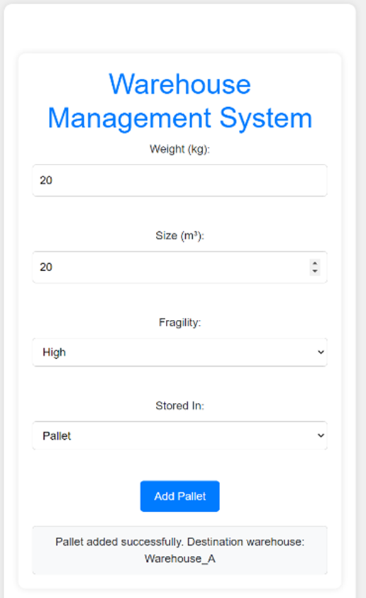
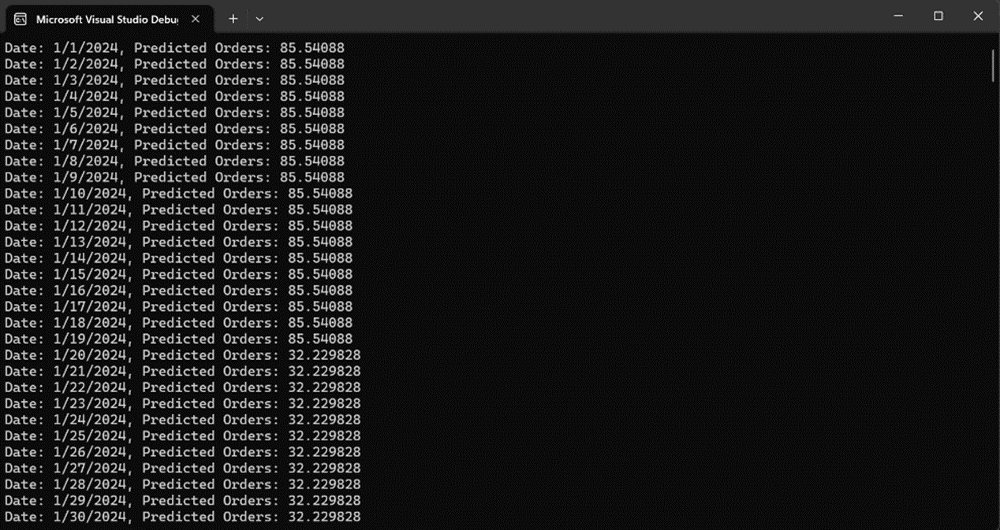
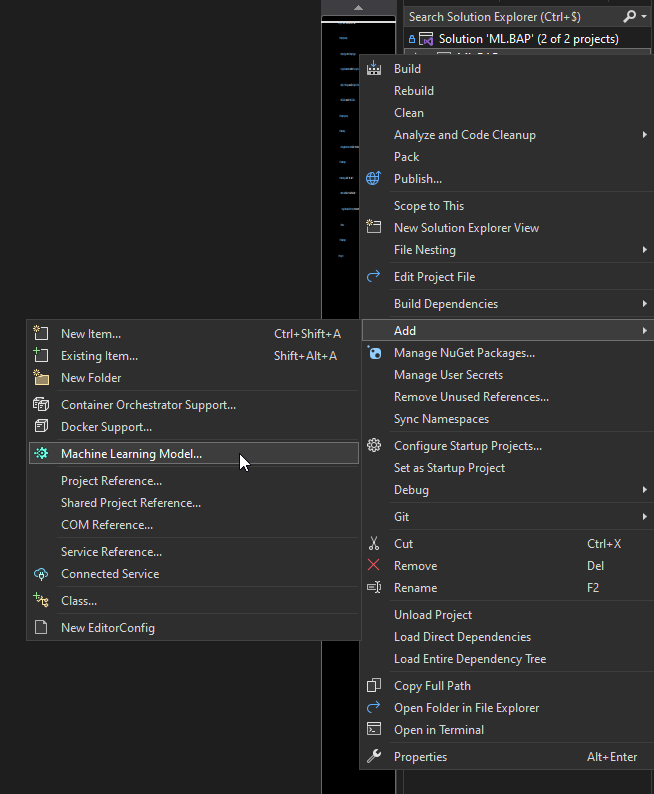
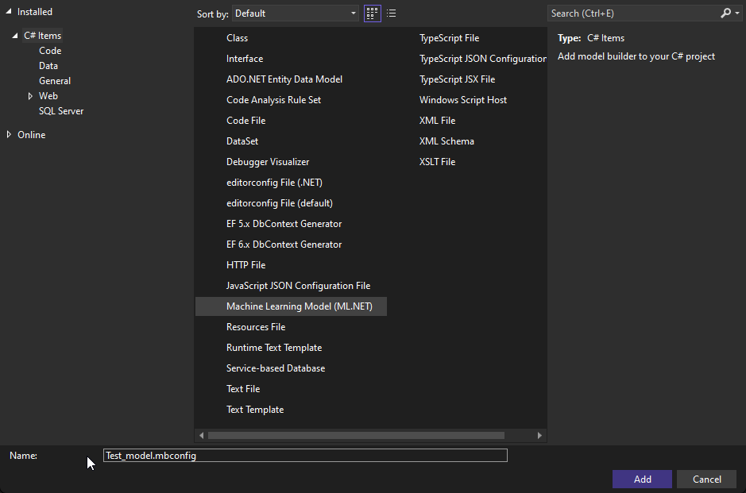
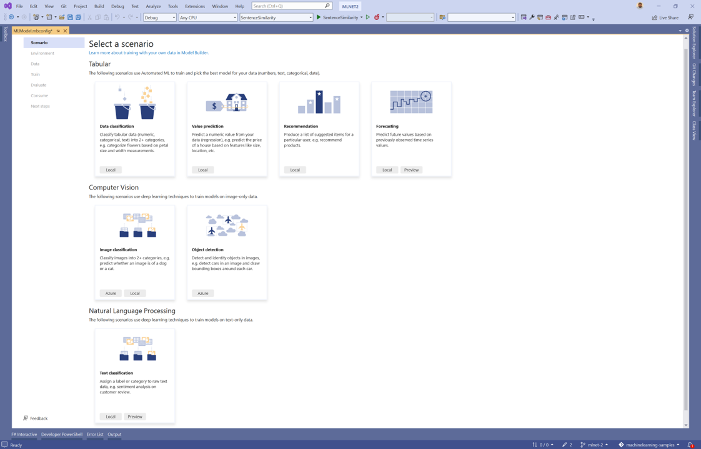
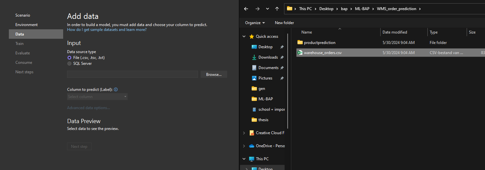
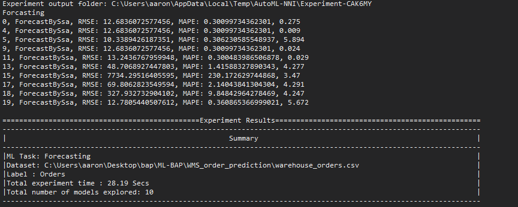
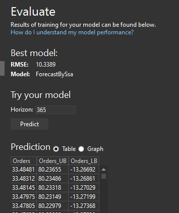

# ML.NET Research for Warehouse Management System (WMS)

Deze repository bevat onderzoek naar het gebruik van ML.NET in een Warehouse Management System (WMS). ML.NET is een krachtig en efficiënt framework voor machine learning in .NET. Hieronder vind je een overzicht van waarom ML.NET gebruikt zou moeten worden, gevolgd door twee voorbeeldapplicaties die in deze repository aanwezig zijn.

## Waarom ML.NET gebruiken in een WMS?

ML.NET biedt snelle en accurate machine learning oplossingen, zoals te zien in de onderstaande afbeelding:


Met ML.NET kun je profiteren van de hoge prestaties en nauwkeurigheid van machine learning modellen, wat essentieel is voor een efficiënt WMS.

## Voorbeelden in deze repository

### WMS Location Prediction

Deze applicatie voorspelt waar orders in de toekomst geplaatst moeten worden, gebaseerd op historische gegevens van waar orders eerder zijn geplaatst. Het model maakt gebruik van de volgende informatie:

- Weight
- Size
- Fragility
- storedIn
- DestinationWarehouse



Dit is een eenvoudig voorbeeld, maar met meer relevante data over de locatie van een order kunnen nog betere voorspellingen worden gemaakt.

### WMS Order Prediction

Deze applicatie voorspelt hoeveel orders er op een bepaalde dag in de toekomst zullen zijn, gebaseerd op de historische data van het aantal orders per dag van de afgelopen paar jaar. Het model maakt gebruik van de volgende informatie:

- Date
- Order amount



Ook hier kunnen betere voorspellingen worden gemaakt door meer relevante data te gebruiken die van invloed is op het aantal orders op een bepaalde dag.


## Hoe de voorbeelden te gebruiken

### WMS Location Prediction

Deze voorbeeldapplicatie heeft een frontend en backend:

- **Frontend**: De frontend code bevindt zich in de map `BAP_frontend`.
- **Backend**: De backend code bevindt zich in de map `ML.BAP`.

Om de WMS Location Prediction applicatie te draaien, moet je het volgende project in de backend map uitvoeren:
- `ML_BAP_API`

### WMS Order Prediction

Deze voorbeeldapplicatie heeft alleen console output:

- Om de WMS Order Prediction applicatie te draaien, navigeer naar de map `productprediction` en voer het bestand `Program.cs` uit.

## Hoe maak je je eigen ML.NET predictie

### 1. **Installeer ML.NET**: Zorg ervoor dat je de ML.NET bibliotheek hebt geïnstalleerd. Dit kun je doen via NuGet Package Manager in Visual Studio of via de .NET CLI:
   ```bash
   dotnet add package Microsoft.ML
   ```
### 2. **Maak een model**: Gebruik Model Builder in Visual Studio om een machine learning model te maken. Model Builder maakt het gemakkelijk om een model te trainen en te evalueren op basis van je dataset.
hoe te Model Builder te installeren:
```bash
Installeer de ML.NET Model Builder: Dit doe je door Visual Studio Installer te openen, je huidige Visual Studio installatie te wijzigen en de ML.NET Model Builder te selecteren.
   ```

### 3. Open Model Builder

Klik met de rechtermuisknop op je project in de Solution Explorer, selecteer **Add** > **Machine Learning**. Dit opent de Model Builder.


### 4. Kies het scenario

Selecteer het scenario dat het beste past bij je voorspellingstaak. Voor locatie voorspellingen kun je bijvoorbeeld kiezen voor **data classification (Regression)**. Voor order voorspellingen kun je kiezen voor **forecasting**.


### 5. Voeg je data toe

Voeg je dataset toe. Dit kan een CSV-bestand zijn dat de historische gegevens bevat die je wilt gebruiken voor het trainen van je model. Zorg ervoor dat je dataset goed is voorbereid en relevante kolommen bevat voor je voorspelling.

### 6. Train het model

Kies hoe lang je Model Builder wilt laten trainen. Hoe langer het traint, hoe beter de prestaties van het model kunnen zijn. Model Builder zal verschillende algoritmen proberen en het beste model selecteren op basis van de prestaties.

### 7. Evalueer het model

Bekijk de evaluatie resultaten. Model Builder zal je laten zien hoe goed je model presteert op basis van verschillende metrics zoals Mean Absolute Error (MAE), Mean Squared Error (MSE), en Root Mean Squared Error (RMSE).

### 8. Gebruik het model

Na het trainen en evalueren, genereert Model Builder code om je model te gebruiken. Deze code kun je toevoegen aan je project om voorspellingen te doen.

```csharp
// Load the model
MLContext mlContext = new MLContext();
IDataView dataView = mlContext.Data.LoadFromTextFile<ModelInput>(path: "your-data.csv", hasHeader: true, separatorChar: ',');

// Train the model
var model = mlContext.Model.Load("model.zip", out var modelInputSchema);

// Use the model
var predictionEngine = mlContext.Model.CreatePredictionEngine<ModelInput, ModelOutput>(model);
var input = new ModelInput { ... };
var prediction = predictionEngine.Predict(input);

Console.WriteLine($"Predicted value: {prediction.PredictedLabel}");